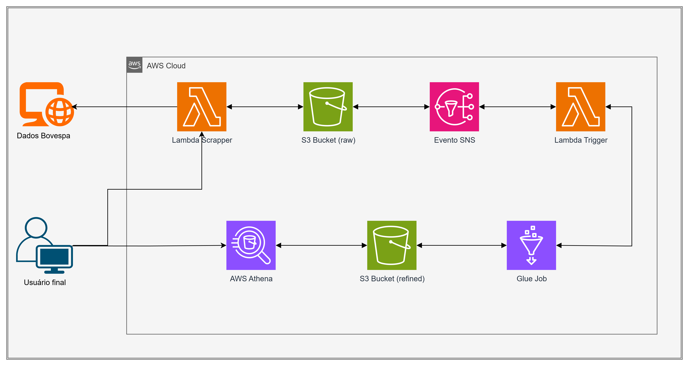

# Tech Challenge 02 - AWS Big Data

### O problema - Pipeline Batch B3: ingestão e arquitetura de dados
Construa um pipeline de dados completo para extrair, processar e analisar dados do pregão da B3, utilizando AWS S3, Glue, 
Lambda e Athena. O link obrigatório para baixar os dados fontes se 
encontra [aqui](https://sistemaswebb3-listados.b3.com.br/indexPage/day/IBOV?language=pt-br). 
Para esse desafio, sua entrega deve conter os seguintes requisitos:
 
- [x] Scrapping de dados do site da B3 com dados do pregão. 
- [x] Os dados brutos devem ser ingeridos no s3 em formato parquet com partição diária.
- [x] O bucket deve acionar uma lambda, que por sua vez irá chamar o job de ETL no glue.
- [x] A lambda pode ser em qualquer linguagem. Ela apenas deverá iniciar o job Glue.
- [x] O job Glue deve ser feito no modo visual. Este job deve conter as seguintes transformações obrigatórias:
  1. Agrupamento numérico, sumarização, contagem ou soma.
  2. Renomear duas colunas existentes além das de agrupamento.
  3. Realizar um cálculo com campos de data, exemplo, poder ser duração, comparação, diferença entre datas.
- [x] Os dados refinados no job glue devem ser salvos no formato *.parquet* em uma pasta chamada refined, particionado por data e pelo nome ou abreviação da ação do pregão.
- [x] O job Glue deve automaticamente catalogar o dado no Glue Catalog e criar uma tabela no banco de dados default do Glue Catalog.
- [x] Os dados devem estar disponíveis e legíveis no Athena.
- [ ] É opcional construir um notebook no Athena para montar uma visualização gráfica dos dados ingeridos.

---

### Etapas para a resolução do desafio
- #### AWS Glue
  - Antes de criar o *Visual ETL*, acesse o menu **Data Catalog > Databases** e crie um banco de dados com o nome desejado. Ex.: *tc_scrapper_db*;
  - Acesse o menu **ETL Jobs > Visual ETL** e crie um job visual com o nome desejado. Ex.: *b3_visual_glue_job*;
  - Ao acessar o job recém criado, inclua as configurações abaixo clicando no botão **+**:
    - **Sources**:
      - **Data source - S3 bucket**:
        - Em S3 URL, selecione o seu bucket e carregue. Ex.: *s3://s3-my-bucket*;
        - Em data format, selecione a opção *Parquet*.
    - **Transforms**:
      - **Transform - Aggregate**:
        - Em Fields to group by - *optional*, selecione as colunas ***ação*** e ***data_pregao***;
        - Em Field to aggregate, selecione o campo ***qtde_teorica*** e em Aggregation function, selecione ***sum***;
      - **Transform - Rename Field**:
        - Em Current field name, selecione ***sum(qtde_teorica)*** e em New field name escreva ***soma_qtde_teorica***;
        - Em Current field name, selecione ***ação*** e em New field name escreva ***nm_acao***;
    - **Targets**:
      - **Data target - S3 bucket**:
        - Em Format, selecione a opção *Parquet*;
        - Em Compression Type, selecione a opção *Snappy*;
        - Em S3 Target Location, informe o caminho do seu bucket, incluindo o diretório **refined**. Ex.: *s3://s3-my-bucket/refined/*;
        - Em Database, selecione a database criada anteriormente ou qualquer outra que você já tenha criado antes;
        - Em Table name, defina um nome para a sua tabela. Ex.: *tb_pregao*;
        - Em Partition Keys, defina uma coluna como referência para uma partição. De preferência uma coluna que contenha data. Ex.: *data_pregao*;
        - Ao término salve o seu job visual.
- #### Amazon SNS
  - Acesse o Amazon SNS e crie um novo tópico com o nome desejado. Ex.: *s3-scrapper-sns*;
  - Selecione o tópico criado e vá até a aba *Política de Acesso*;
  - Edite a política de acesso e na seção onde está o atributo *Resource*, deixe conforme o exemplo abaixo:
  - ```
    "Resource": "arn:aws:sns:us-east-1:1234567890:s3-scrapper-sns",
      "Condition": {
        "StringEquals": {
          "AWS:SourceAccount": "1234567890"
        }
      }
    ```
  - **Importante**: O atributo Resource será o mesmo endereço do seu S3 bucket.
- #### S3 Bucket
  - Acesse o AWS Console e crie um bucket S3 com o nome desejado. Ex.: *s3-scrapper-bucket*;
  - Após a criação do bucket, selecione-o, vá até a aba *Propriedades > Notificações de eventos*, clicando em ***Criar notificação de evento***;
    - Em configuração geral, selecione o diretório *raw/*;
    - Em Tipos de evento, selecione a opção *Todos os eventos de criação de objeto*;
    - Em Destino, selecione *Tópico do SNS*;
    - Em Especificar Tópico do SNS, selecione Inserir ARN do Tópico do SNS e insira o endereço do tópico do SNS. Ex.: *arn:aws:sns:us-east-1:123456789:s3-scrapper-sns*.
- #### Lambda
  - ##### Scrapper Lambda function:
    - Acesse o AWS Console e crie uma nova função lambda e adicione as roles que permitem acesso ao S3;
    - Adicione o código do arquivo ``lambda_function.py`` e realize um deploy;
    - Após finalizar o deploy, vá em layers e selecione a opção *Adicionar uma camada*;
    - Adicione a camada ***AWSSDKPandas-Python313***, selecionando a versão mais recente e salve;
    - Para validar se as bibliotecas foram instaladas corretamente, clique na aba **Testar** e realize um novo teste da sua função.
  - ##### Glue Lambda trigger:
    - Adicione o código do arquivo ``lambda_trigger.py`` e realize um deploy;
    - Na tela principal do Lambda, selecione a opção *Adicionar gatilho* e inclua o trigger SNS criado nas etapas anteriores.

--- 
### Desenho com as etapas da solução:

